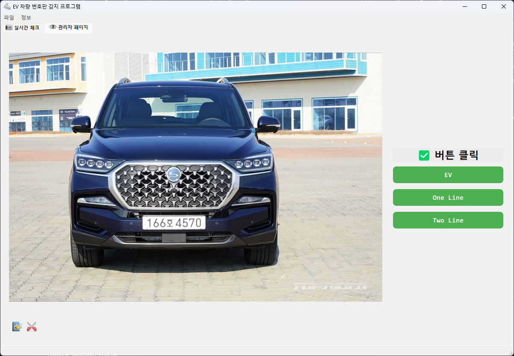

# 관리자용 프로그램 (PyQt)



## 버전 종류
- `./version_table/` : 표 버전
- `./version_button/` : 버튼 버전

## 프로그램 실행 방법
- 각 폴더 안에 있는 `main.py` 코드를 실행합니다.

## 패키지 설치

### PyQt5

```shell
> pip install pyqt5
```

### OpenCV Python

```shell
> pip install opencv-python
```

### fugueicons

```shell
> pip install pyqt5-fugueicons
```
